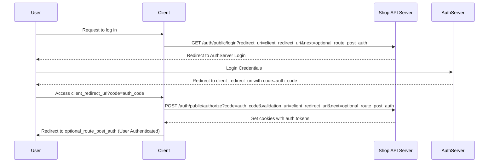

# Authentication

Tiendify uses a centralized server for authentication, which is a session-cookie based system. This page describes the flow your website should follow in order to provide authentication for them.

:::info

Not every endpoint of Customers API requires customer authentication. You can check the available services and their requirements in the [**API Reference**](/docs/Customers%20API/reference)

:::

## Authentication flow

When a user (customer) tries to login:

1. First, you should call [Init login endpoint](/docs/tiendify/redirect-to-keycloak-auth-public-login-get). This will redirect the user to the login page in the Authentication Server. After the user logs in successfully, they will be redirected to the URI in your website specified when calling this endpoint.
2. The user will be redirected with a URL query parameter `code`. Then, you should use this code to call [Authorize Login endpoint](/docs/tiendify/authorize-auth-public-authorize-post).

If the authorization is successful, the user will receive two cookies: `access_token` and `remember_token`. These cookies will authorize the user to make transactions such as creating new orders.

After user is logged in, [Current User Info endpoint](/docs) can be called.

## Keypoints about cookies

Session cookies are marked as `HttpOnly`, this means they are not accesible through JavaScript. They will be automatically included by the browser in subsequent requests.

:::warning

For these cookies to be sent by the browser, you must allow the use of credentials (cookies). For example, when using Axios as HTTP client, make sure you set `withCredentials` option to `true`.

:::

### Token Refreshing

`access_token` cookie expires rapidly (few minutes), but it can be refreshed if there's presence of `refresh_token` cookie. To refresh the session, you must call [Init login endpoint](/docs/tiendify/redirect-to-keycloak-auth-public-login-get) again. If user's session is still active in the Authentication Server, it will be instantly redirected back with a fresh session.

**How to know when to redirect the user**

The previously mentioned [Current User Info endpoint](/docs) will respond with:

- `401 Unauthorized`, if the user is not authenticated.
- `403 Forbidden`, if the user is authenticated but the session has expired.

So, when receiving `403`, you should refresh the session by redirecting the user as indicated above.
